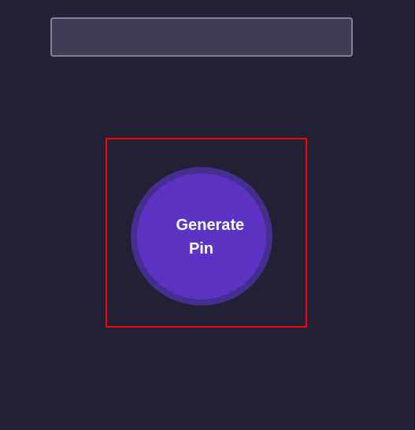
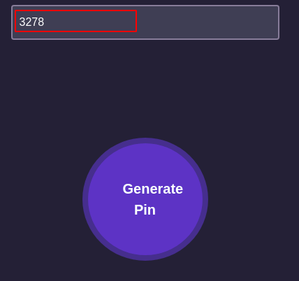
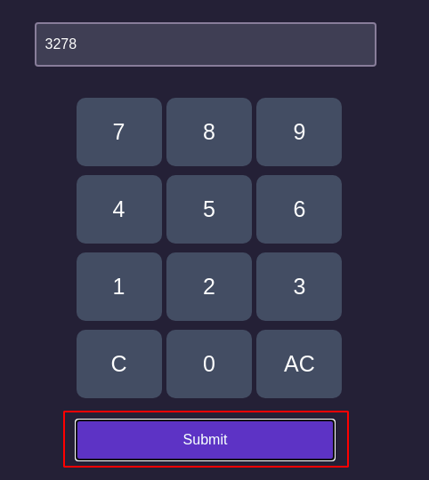

# 2 step verification code, pin match, verification code, code generate and match, etc with javaScript.
### For testing all you have to do follow those screenshot.
📝 At very first you have to genarate a passcode for open the safe.After genarate the passcode,submit this passcode.

## 🤘 voila!! it worked

## 🦉 For live testing click this [pin-matcher](https://shakil5161.github.io/pin-matcher/) 
### ThakYou 👍

